# Explainable Chest X-Ray Classification using Vision Transformers and Saliency-Based XAI Techniques

## Overview

This project presents an Explainable Artificial Intelligence (XAI) framework for automated chest X-ray classification using a pretrained **Vision Transformer (ViT-Base Patch16-224)** model. The system classifies chest X-ray images into three categories:

- COVID-19
- Normal
- Viral Pneumonia

In addition to achieving high classification performance, the project investigates the interpretability of model predictions using multiple explainability techniques and quantitatively evaluates their effectiveness.

---

# Model Architecture

<p align="center">
  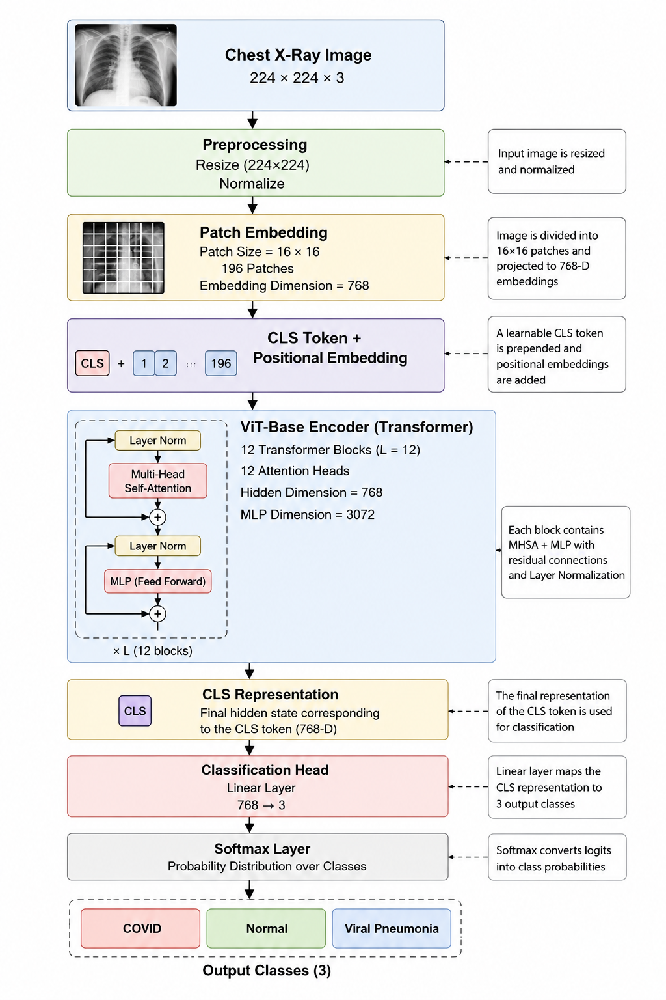
</p>

The proposed framework utilizes a pretrained Vision Transformer (ViT-Base Patch16-224) initialized with ImageNet weights and fine-tuned on chest X-ray images. The model processes 224×224 chest radiographs and predicts one of three disease classes.

---

# Key Results

## Test Accuracy: 97%

The Vision Transformer achieved approximately **97% test accuracy**, demonstrating strong performance in multi-class chest X-ray classification.

### Classification Example

<p align="center">
  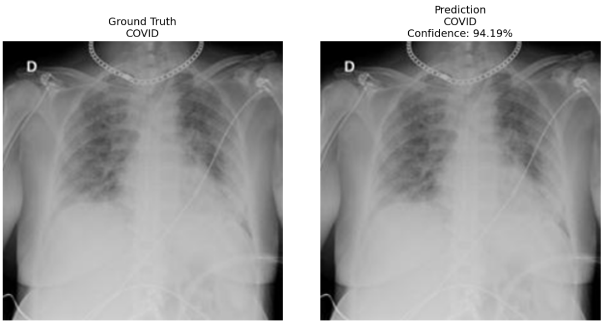
</p>

The model produces highly confident predictions while maintaining excellent generalization across the test dataset.

---

# Performance Metrics

<p align="center">
  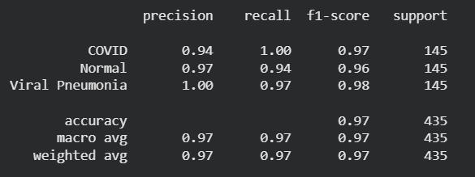
</p>

Performance was evaluated using:

- Accuracy
- Precision
- Recall
- F1-Score

The model achieved consistently strong results across all three classes.

---

# Confusion Matrix

<p align="center">
  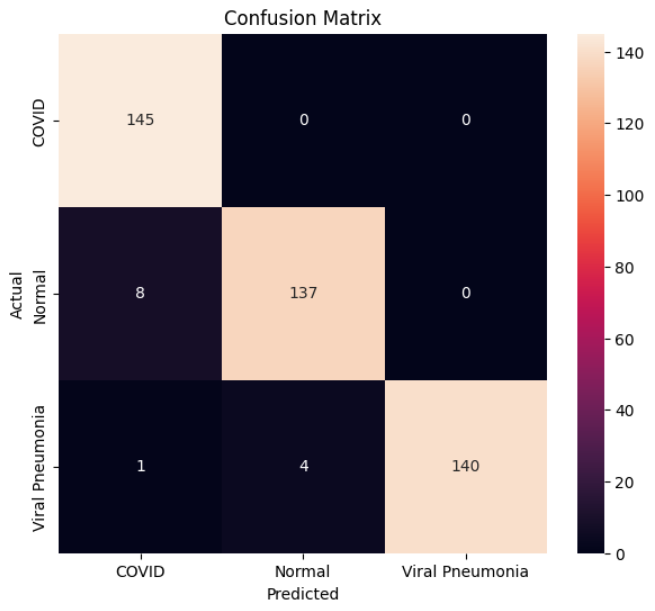
</p>

The confusion matrix demonstrates the model's ability to distinguish between:

- COVID-19
- Normal
- Viral Pneumonia

with very few misclassifications.

---

# Training Loss Curve

<p align="center">
  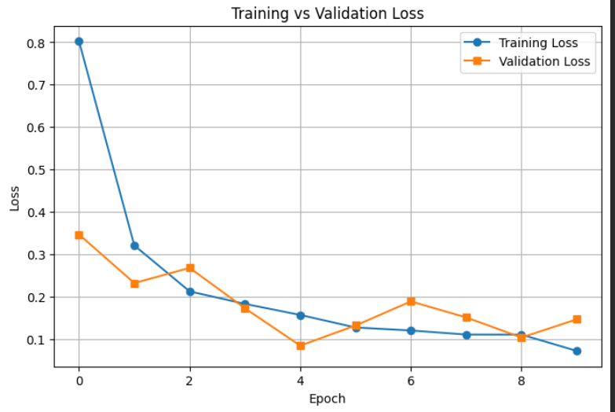
</p>

Training and validation loss curves indicate stable convergence with minimal overfitting.

---

# Explainable AI (XAI) Analysis

A major goal of this project was to investigate how different explainability techniques interpret Vision Transformer predictions on chest X-ray images.

The following XAI methods were implemented and evaluated:

- Grad-CAM
- Integrated Gradients
- LIME
- SHAP
- Attention Rollout

---

## 1. Grad-CAM

<p align="center">
  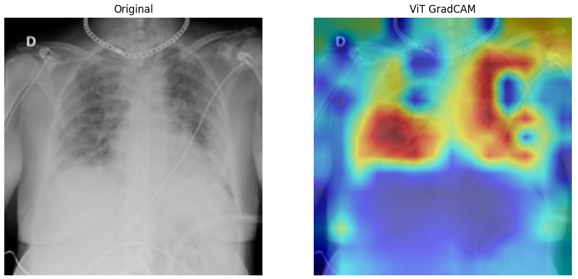
</p>

### Observation

- Produced the most clinically meaningful explanations.
- Consistently highlighted disease-related lung regions.
- Achieved the best quantitative evaluation scores.

---

## 2. Attribution Map (Integrated Gradients)

<p align="center">
  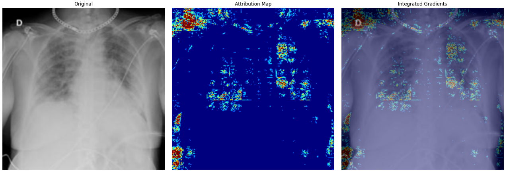
</p>

### Observation

- Generated sparse attribution maps.
- Sometimes produced noisy explanations.
- Effective but less localized compared to Grad-CAM.

---

## 3. Attention Rollout

<p align="center">
  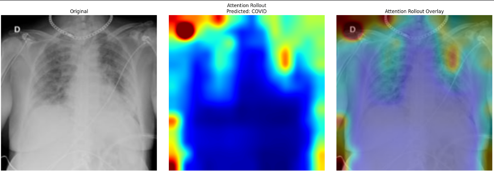
</p>

### Observation

- Visualizes attention flow inside the Vision Transformer.
- Occasionally focuses on image borders and non-pathological regions.
- Demonstrates that attention does not always correspond to feature importance.

---

## 4. LIME

<p align="center">
  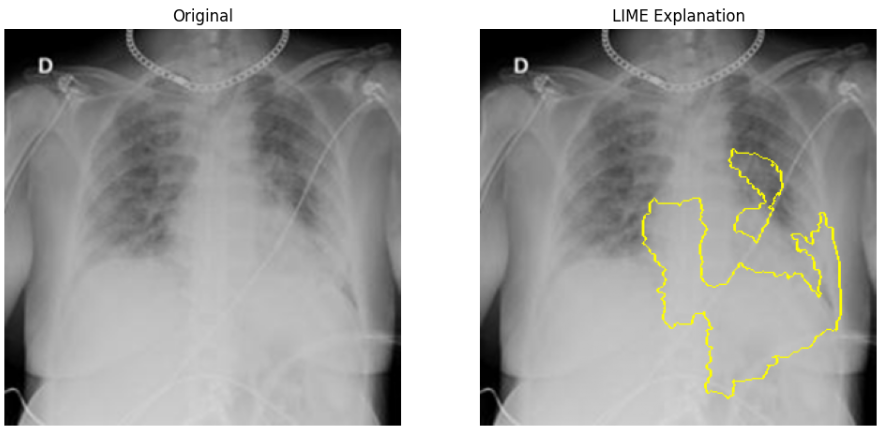
</p>

### Observation

- Provides local perturbation-based explanations.
- Highly dependent on superpixel segmentation.
- Produced variable explanations across images.

---

## 5. SHAP

<p align="center">
  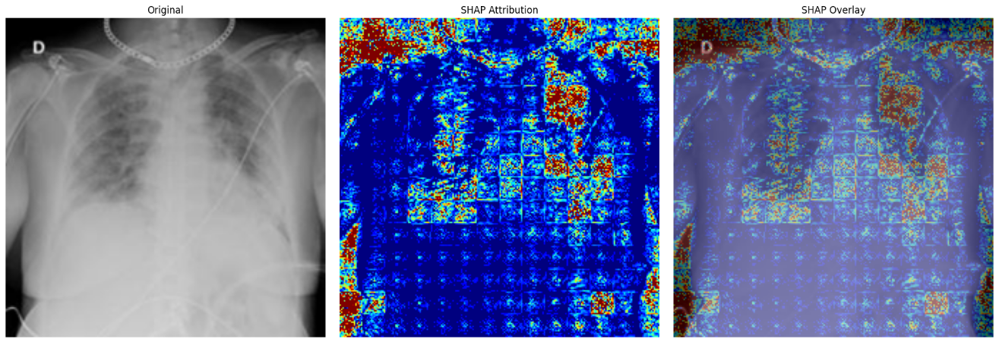
</p>

### Observation

- Computationally expensive.
- Generated noisy saliency maps in several cases.
- Less reliable for Vision Transformer-based chest X-ray interpretation.

---

# Quantitative XAI Evaluation

<p align="center">
  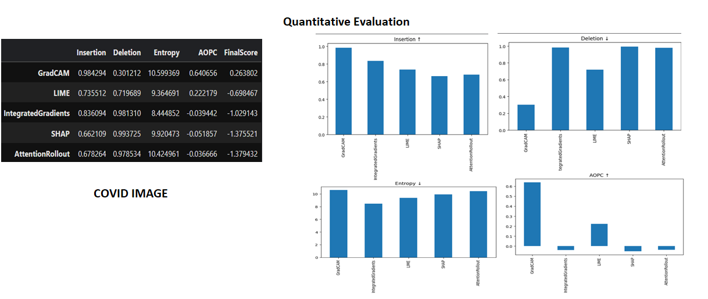
</p>

The explainability methods were quantitatively evaluated using:

- Insertion ↑
- Deletion ↓
- Entropy ↓
- AOPC ↑

### Key Finding

**Grad-CAM consistently achieved the strongest performance across COVID-19, Normal, and Viral Pneumonia images.**

The method showed:

- Highest insertion scores
- Strong AOPC values
- Better localization of pathological lung regions
- More stable explanations

These findings align with observations reported in:

1. *Explainable AI for Medical Data: Current Methods, Limitations, and Future Directions*
2. *Explainable Artificial Intelligence in Medical Imaging: A Systematic Review of Techniques, Applications and Challenges*

Both studies identify Grad-CAM as one of the most effective and clinically useful explainability techniques for medical imaging applications.

---

# Limitations

Several challenges were observed during explainability analysis:

- Integrated Gradients produced sparse and noisy saliency maps.
- LIME was sensitive to superpixel generation.
- SHAP required high computational resources.
- Attention Rollout occasionally highlighted irrelevant image regions.
- Existing evaluation metrics measure faithfulness but not clinical relevance.

---

# Proposed Future Direction

We propose a **Lung-Guided Consensus Explainability Framework (LGCEF)**:

- Combine Grad-CAM, Integrated Gradients, and Attention Rollout.
- Incorporate anatomical lung-region priors.
- Generate consensus saliency maps.
- Improve robustness and clinical interpretability.

This direction addresses limitations identified in both experimental results and recent medical XAI literature.

---

# Tech Stack

- Python
- PyTorch
- timm
- Vision Transformer (ViT-Base Patch16-224)
- OpenCV
- NumPy
- Matplotlib
- Captum
- LIME
- SHAP

---

# Dataset

COVID-19 Chest X-Ray Dataset containing:

- COVID-19
- Normal
- Viral Pneumonia

Dataset Structure:

```text
COVID_19_dataset/
│
├── train/
├── val/
└── test/
     ├── COVID/
     ├── Normal/
     └── Viral Pneumonia/
```

---

# Author

**Swapnil Banerjee**

Vision Transformer-based Explainable AI Framework for Chest X-Ray Disease Classification.